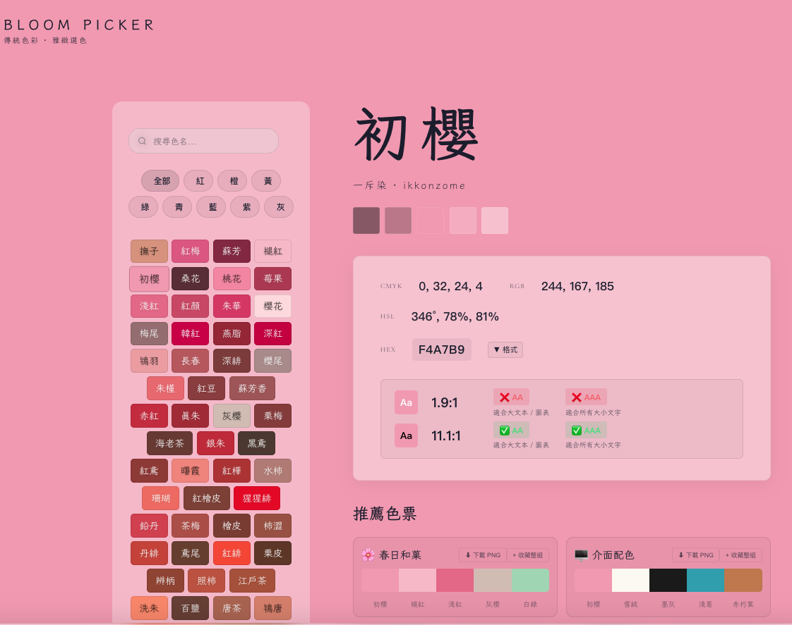
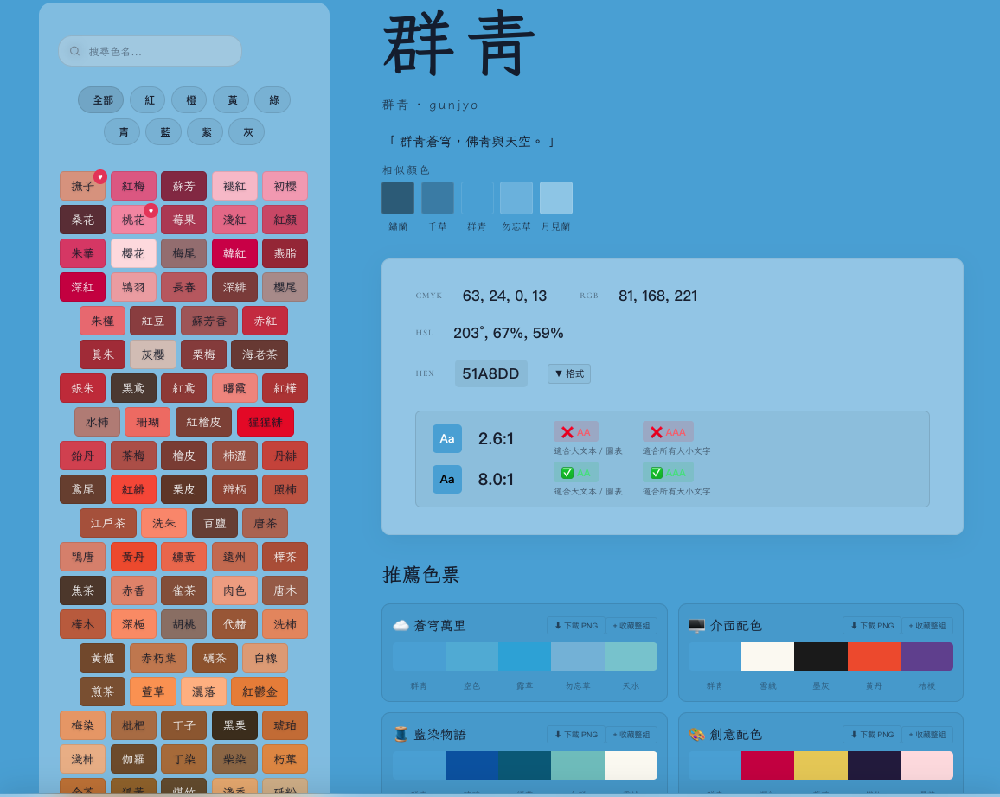
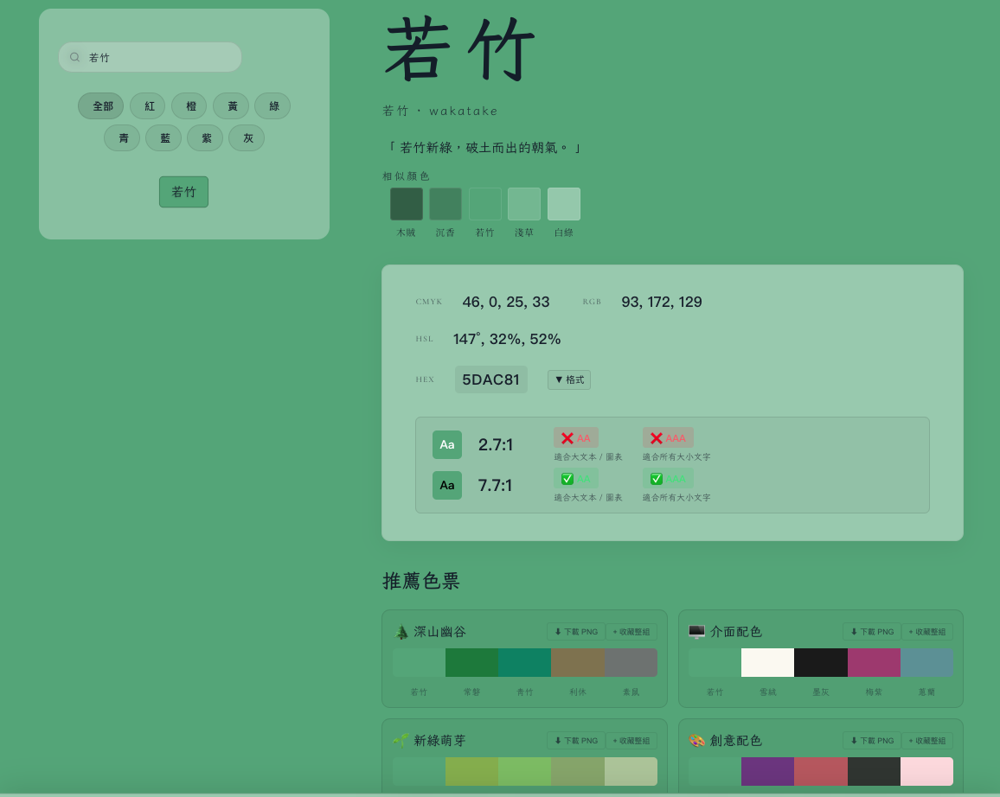
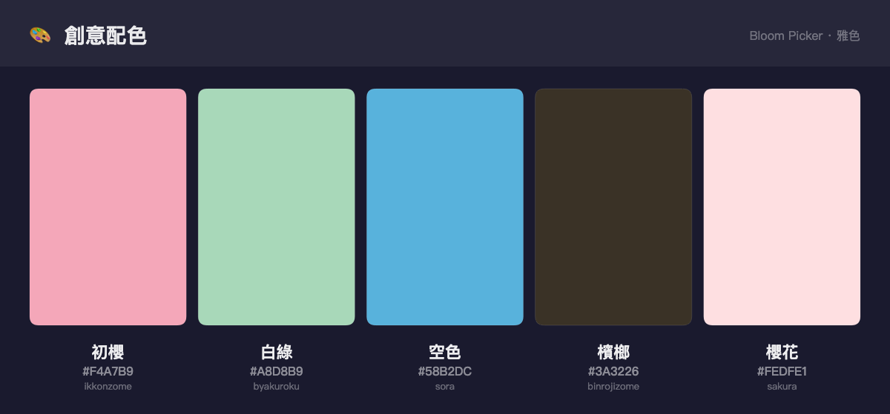
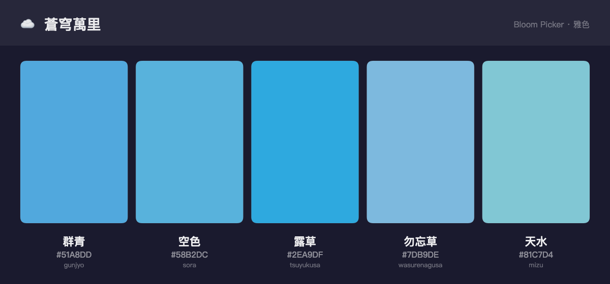
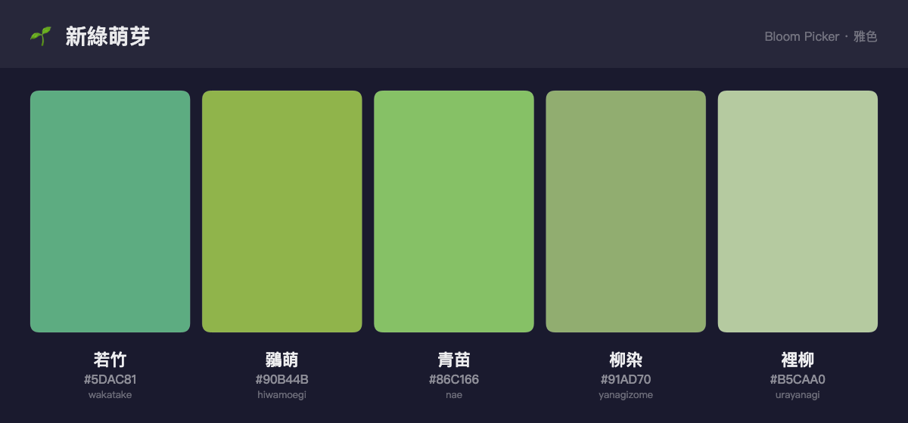
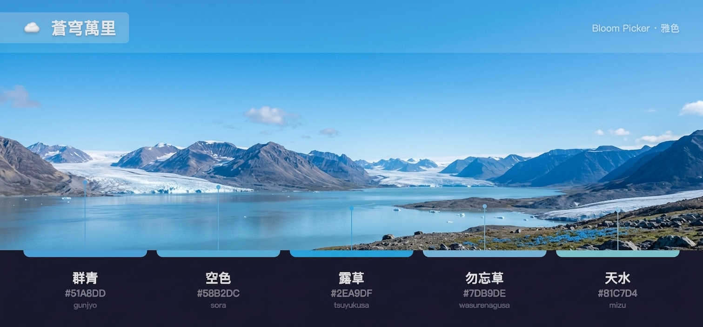
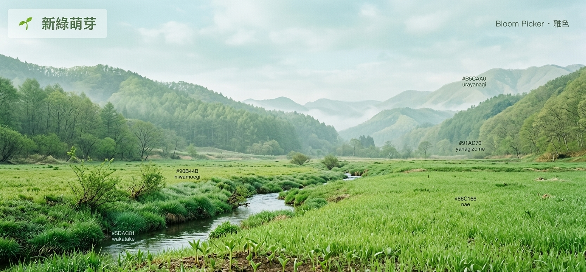

# Bloom Picker · 雅色


Bloom Picker 不只是一個色碼查詢工具，而是把 **東亞傳統色** 與 **現代工作流程** 接軌的橋樑：

- **設計與品牌**：250 款具文化脈絡的色名與色碼，方便品牌、視覺與 UI 設計師快速取用，並可匯出 CSS 變數或 JSON 整合進設計系統。
- **無障礙與合規**：內建 WCAG 2.1 對比度計算與 AA/AAA 提示，有助於在美觀與可讀性之間取得平衡，貼近無障礙設計需求。
- **文化與在地化**：色名以台灣慣用繁體呈現（如 桜→櫻、黒→黑），保留傳統色感同時提升在地辨識度，適合需要「雅緻」語境的專案。
- **探索與靈感**：透過「今日之色」、隨機一色與演算法推薦色票，降低配色門檻，適合快速發想與教學示範。

---

## 預覽

|  | **初櫻** | **群青** | **若竹** |
|--|----------|----------|----------|
| 主畫面 |  |  |  |
| 推薦色票 |  |  |  |
| 概念圖 |  |  |  |

---

## 特色

- **全螢幕色塊體驗**：點選側邊色名即切換整頁背景色，過場平滑、無按鈕閃爍感。
- **繁體中文在地化色名**：日文漢字統一轉為台灣慣用繁體（如 桜→櫻、黒→黑、黄→黃），兼顧原始風味與可讀性。
- **完整色碼資訊**：顯示 CMYK / RGB / HSL / HEX，點擊 HEX 可直接複製。
- **WCAG 對比度檢查**：自動計算與黑 / 白文字的對比比率，顯示 AA / AAA 通過狀態與簡易圖示。
- **推薦色票**：依據色距與色相演算法推薦搭配組合，可一次收藏整組或匯出 PNG。
- **調色盤收藏與排序**：支援收藏喜愛色、拖拉排序，並匯出為 CSS 變數或 JSON，方便貼到設計系統 / 專案。
- **Hash 路由與動態標題**：網址 `#color-name` 可直接連到指定色，瀏覽器標籤顯示「群青 · Bloom Picker」這類標題，方便多分頁辨識。
- **探索入口**：提供「今日之色」與「隨機一色」按鈕，適合靈感探索與每日配色。

## 技術棧

- **框架**：React + TypeScript
- **開發工具**：Vite
- **動畫**：Framer Motion
- **圖示**：Lucide React
- **色彩邏輯**：自訂色距與推薦演算法、WCAG 2.1 對比度計算

## 開發與啟動

專案為 React + TypeScript（Vite），請以 Node.js 啟動開發伺服器：

```bash
npm install
npm run dev
```

預設會開啟 `http://localhost:5173/`（以終端機輸出為準）。

## 部署到 GitHub Pages

建置後的 `dist` 可部署至 GitHub Pages 或任一靜態主機。

1. 將專案 push 到 GitHub 倉庫。
2. 在倉庫 **Settings → Pages**：
   - **Source** 選 **Deploy from a branch**
   - **Branch** 選 `main`（或你的預設分支），資料夾依部署方式選 `/ (root)` 或 `dist/`
3. 儲存後等待數分鐘，網站會出現在：
   - `https://<你的帳號>.github.io/bloom-picker/`

## 檔案結構（簡要）

```text
bloom-picker/
├── index.html
├── favicon.svg
├── image/                    # README 截圖與示意圖
├── src/
│   ├── main.tsx              # React 進入點
│   ├── App.tsx               # 主畫面組裝
│   ├── App.css               # 版面與動效樣式
│   ├── components/           # Header / ColorSidebar / ColorDetail / PaletteReco / FavoriteDrawer 等
│   ├── data/                 # 顏色資料與推薦色票
│   └── utils/                # 色彩轉換、WCAG 對比、主題 token、匯出工具
├── legacy/                   # 早期純靜態版本（保留作參考）
├── package.json
├── vite.config.ts
└── README.md
```

## 色名與資料

色名以「傳統色名 · 台灣口語 · 高貴優雅」為原則，沿用東亞傳統色名並統一為繁體中文。色碼資料改寫自日本傳統色（如 NIPPON COLORS 等公開資料），僅作轉寫與在地化，非商業用途。

## 授權

專案內色碼資料改寫自公開之日本傳統色資料；網頁結構與程式為本專案原創。
